# FamilyPointApp
Đề tài lớn môn Lập trình thiết bị di dộng: FamilyPoint App
* Thành viên tham gia đề tài:
  - Huỳnh Minh Thủ
  - Nguyễn Đặng Đức Tài

# FamiPoint Mobile App

Family Point là ứng dụng được thiết kế lại từ ứng dụng FamiPoint của chuỗi cửa hàng FamilyMart, ứng dụng cho phép người dùng tích điểm, sữ dụng điểm tích lũy, theo dõi lịch sử mua hàng, xem và sử dụng các mã khuyến mãi của người dùng khi mua các đơn hàng tại các hệ thống cửa hàng.

## Màn hình chính

### 1. Trang chủ
- Màn hình trang chủ hiển thị thông tin tổng quan về tài khoản người dùng, các tính năng chính, quà tặng, và các thông tin khuyến mãi hiện có.

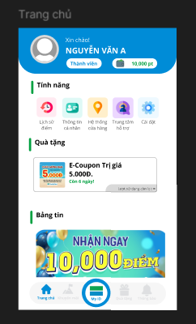

### 2. Đăng nhập
- Giao diện đăng nhập đơn giản với yêu cầu nhập số điện thoại và mã PIN để truy cập vào tài khoản của bạn.

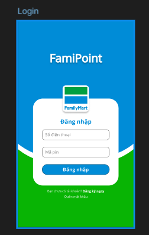

### 3. Đăng ký
- Người dùng mới có thể đăng ký tài khoản bằng cách nhập thông tin cá nhân như họ tên, số điện thoại, mã PIN, và ngày sinh.

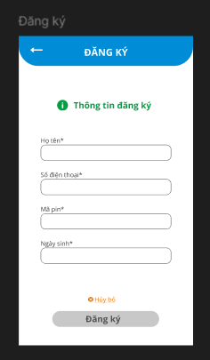

### 4. Quên mã PIN
- Người dùng có thể yêu cầu đặt lại mã PIN bằng cách nhập số điện thoại đã đăng ký.

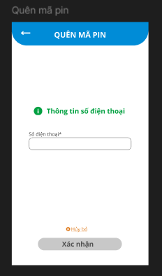

### 5. Thông tin cá nhân
- Màn hình này cho phép người dùng xem và cập nhật thông tin cá nhân của mình, bao gồm họ tên, số điện thoại, giới tính, ngày sinh, quốc tịch, và địa chỉ.

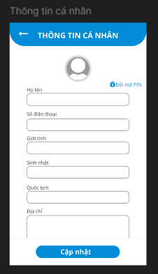

### 6. Thay đổi mã PIN
- Người dùng có thể thay đổi mã PIN của mình bằng cách nhập mã PIN cũ và mã PIN mới.

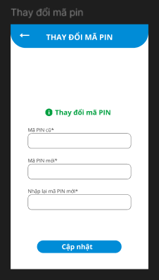

### 7. My ID - Lịch sử điểm
- Màn hình này cho phép người dùng xem lịch sử điểm của họ, bao gồm các giao dịch cộng và trừ điểm.

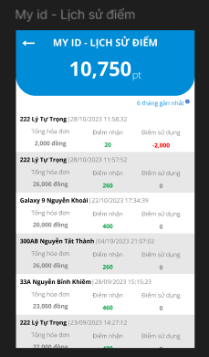

### 8. My ID - Thanh toán
- Người dùng có thể quản lý phương thức thanh toán của mình tại đây, bao gồm các ví điện tử như MoMo, ZaloPay, và VNPAY.

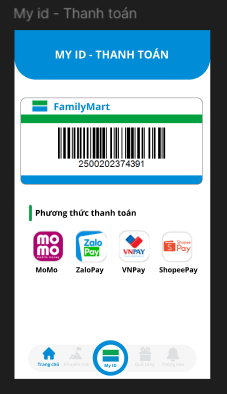

### 9. Khuyến mãi
- Người dùng có thể xem các khuyến mãi hiện có và sắp tới trong phần này.

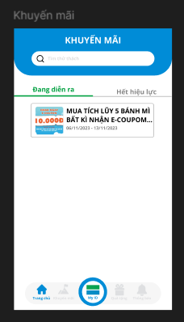

### 10. Quản lý phiếu quà tặng
- Màn hình này cho phép người dùng quản lý phiếu quà tặng và sử dụng mã khuyến mãi của họ.

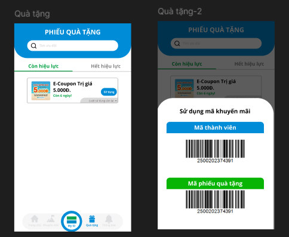

### 11. Phiếu quà tặng chi tiết
- Hiển thị thông tin chi tiết về phiếu quà tặng, bao gồm giá trị, ngày hết hạn, và mã phiếu.

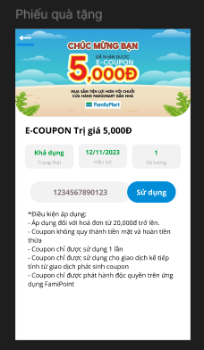

### 12. Mã vạch phiếu quà
- Người dùng có thể sử dụng mã vạch phiếu quà tặng trực tiếp từ ứng dụng để nhận khuyến mãi tại cửa hàng.

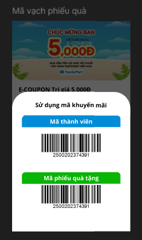

### 13. Thông báo
- Màn hình thông báo hiển thị các tin tức mới nhất từ FamiPoint, giúp người dùng cập nhật thông tin kịp thời.

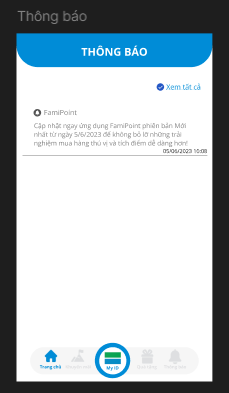

### 14. Cài đặt
- Giao diện cài đặt cho phép người dùng tự động đăng nhập và tùy chỉnh cách ứng dụng hiển thị.

### 15. Hỗ trợ
- Màn hình hỗ trợ cung cấp thông tin liên lạc với trung tâm hỗ trợ và các câu hỏi thường gặp.

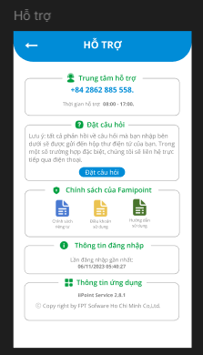

### 16. Đặt câu hỏi
- Người dùng có thể gửi câu hỏi trực tiếp đến trung tâm hỗ trợ thông qua giao diện này.

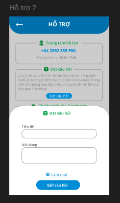

